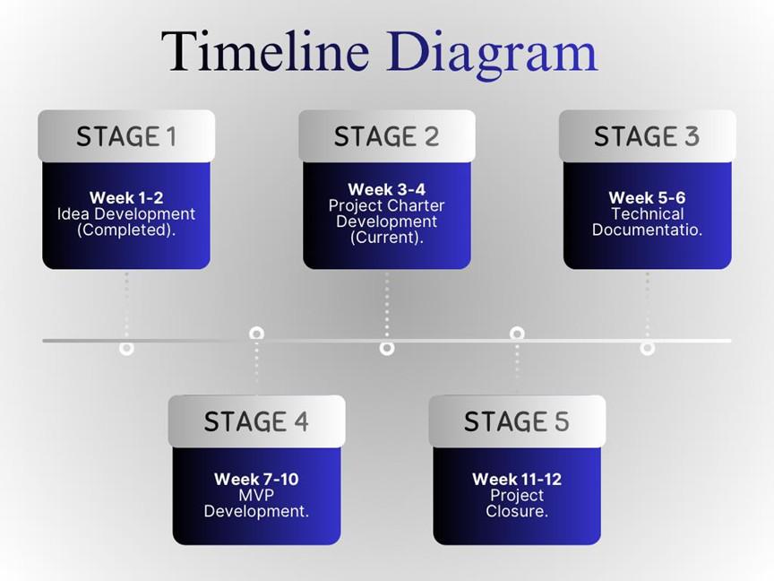

# Project Charter Development

## Project Overview

## 1. Project Objectives

### Purpose

Madar exists because thousands of students enter university every year without a clear understanding of what their chosen major truly involves or where it can take them professionally. The result is wasted years, dropped courses, and careers that never fit. Madar bridges that gap by combining structured major exploration with AI-powered guidance, giving students a hands-on way to experience a field before committing to it. The platform matters because it does not just inform but engages, tests, and scores, turning a passive decision into an active discovery.

### Objectives

**Objective 1 : Demystify University Majors**
Enable students to explore any university major through AI-generated explanations that are clear and personalized to their level, so that within a single session, a user with zero prior knowledge can accurately describe what the major covers, what skills it builds, and what careers it leads to.

**Objective 2 : Simulate Real-World Exposure Through Tasks**
For each major, deliver at least one AI-guided practical task that the student completes with live AI assistance, measured by a performance score, so users gain a concrete experience-based sense of whether the field suits them.

**Objective 3 : Guide Specialization Within a Major**
Help students who have chosen a broad major such as Computer Science navigate its sub-tracks like AI, Cybersecurity, or Software Engineering by asking targeted questions and mapping their interests and strengths to the most fitting specialization, reducing confusion and mid-degree switches.

---

## 2. Stakeholders & Roles

**Internal:**
- Development team (Noura, Thekra, Ghaida, Najla)
- Project supervisor

**External:**
- End-users: high school graduates, university students, and career switchers

**Team Roles:**

| Name | Role | Responsibilities |
| --- | --- | --- |
| Noura | Backend Developer | API development, Server setup, database |
| Thekra | Backend Developer | App logic, AI integration |
| Ghaida | Frontend Developer | UI design, user experience |
| Najla | AI Engineer | Simulation logic, promotes, evaluation models |
| Supervisor | Project Advisor | Reviews progress, provides academic guidance |

> The table above summarizes all stakeholders and team roles with clear accountability assigned to each member.

---

## 3. Project Scope

Build a web-based platform that enables users to experience real job tasks through AI-powered simulations and receive a fit score based on their performance, replacing traditional theoretical assessments.

**In-scope:**
- **AI Job Simulation:** Present role-specific tasks for users to complete
- **Career Library:** Pre-generated tasks for each role
- **User Accounts:** Track user progress
- **Fit Score System:** Evaluate user responses and generate performance scores
- **Web Platform:** Browser-based
- **Multilingual Support:** Full support for Arabic (RTL) and English (LTR)

**Out-of-scope:**
- Live mentorship or human career coaching
- Job board, recruitment tools, or job application features
- Resume / CV builder or LinkedIn integration
- Certifications or official career assessments
- Native mobile application (iOS / Android)
- Company-side or HR/recruiter-facing dashboards
- Paid courses, learning content, or certification programs
- Act as a recruitment agency or connect users to employers

**Constraints:**
- **Timeline:** The project must be ready within 12 weeks.
- **AI Dependency:** Core functionality depends on external AI APIs, including their limitations (cost, latency, reliability)

---

## 4. Risks

- Team members lack experience with AI tools
- AI responses are inaccurate or irrelevant
- Uneven workload distribution among team
- Delays in frontend-backend integration
- Low user engagement during simulation
- Communication gaps between team members
- Scope creep (adding too many careers/features)

**Mitigation Strategy:**
- Schedule early tutorials; allocate learning time in sprint 1
- Test prompts thoroughly; add human-reviewed fallback answers
- Weekly check-ins; clear task assignments via project board
- Define APIs early; agree on data structure before coding begins
- Run user testing with real students; iterate based on feedback
- Lock MVP scope early; save extra features for v2
- Use a shared channel (WhatsApp/Discord) for daily updates

---

## 5. High-Level Project Plan
