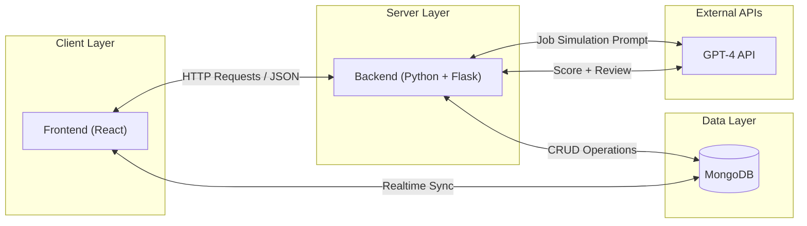
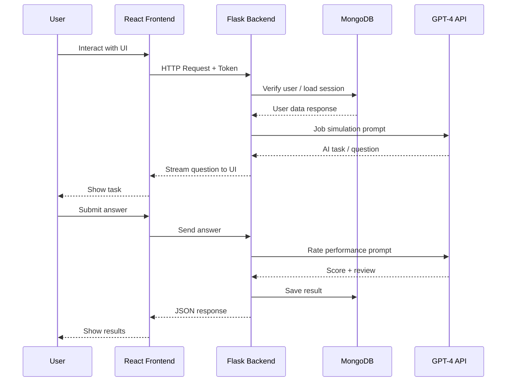

# High-Level Package Diagram (Three-Layer Architecture)

## Architecture Overview

The system is designed as a full-stack web platform following a **three-layer architecture** that ensures scalability, maintainability, and clear separation of concerns.

The architecture consists of a **client layer** for user interaction, a **server layer** for business logic and system operations, and a **data layer** for data persistence and AI integration.

---

## System Components

| Component | Technology | Description |
|-----------|------------|-------------|
| Frontend | React | Single Page Application (SPA) responsible for rendering the user interface and handling user interactions |
| Backend | Python (Flask) | RESTful API server responsible for business logic, request validation, authentication, and integrations |
| Database | MongoDB | NoSQL database used for storing users, sessions, job results, and conversation history |
| AI API | GPT-4 | Powers the job simulation scenarios and generates performance ratings and reviews |

---

## Architectural Principles

- **Separation of Concerns:** Each layer is responsible for a specific set of tasks, reducing coupling between components.
- **Scalability:** The backend and data layers can scale independently based on system load.
- **Security:** Authentication is handled at the backend layer with token-based verification.
- **Extensibility:** The architecture allows for easy integration of additional services and features in future phases.

---

## Data Flow

---

## Sequence Diagram

